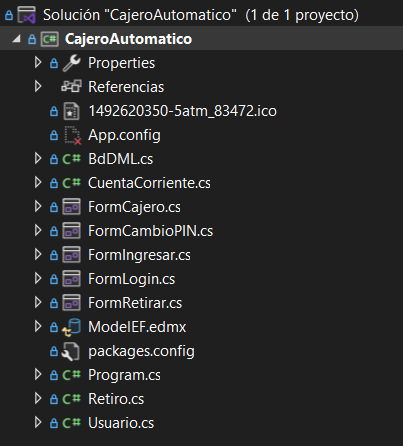
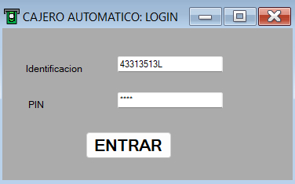
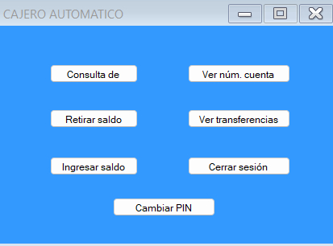
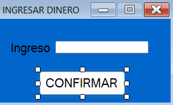
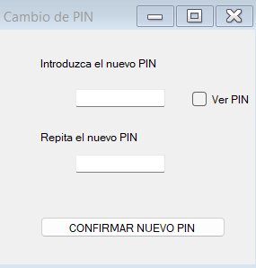

# 🏧 Cajero Automático

Una aplicación de consola desarrollada en **C#** utilizando **Visual Studio 2022** y **Entity Framework** que simula el funcionamiento básico de un cajero automático. 
Permite a los usuarios iniciar sesión, consultar su saldo, realizar depósitos, retiros y ver el historial de transacciones.

## 🚀 Características

- Inicio de sesión con validación de credenciales
- Consulta de saldo actual
- Depósitos y retiros con actualización automática del balance
- Registro de transacciones con fecha y hora
- Persistencia de datos mediante Entity Framework y base de datos local

## 🛠️ Tecnologías utilizadas

- 💻 **Lenguaje:** C#
- 🧰 **IDE:** Visual Studio 2022
- 🗃️ **ORM:** Entity Framework Core
- 🛢️ **Base de datos:** SQL Server LocalDB
- 📦 **.NET Framework 4.7.2**

## 📂 Estructura del proyecto

## INTERFAZ GRÁFICO DE LA APLICACIÓN

LOGIN

VENTANA PRINCIPAL DE LA APLICACIÓN

OTRAS VENTANAS

